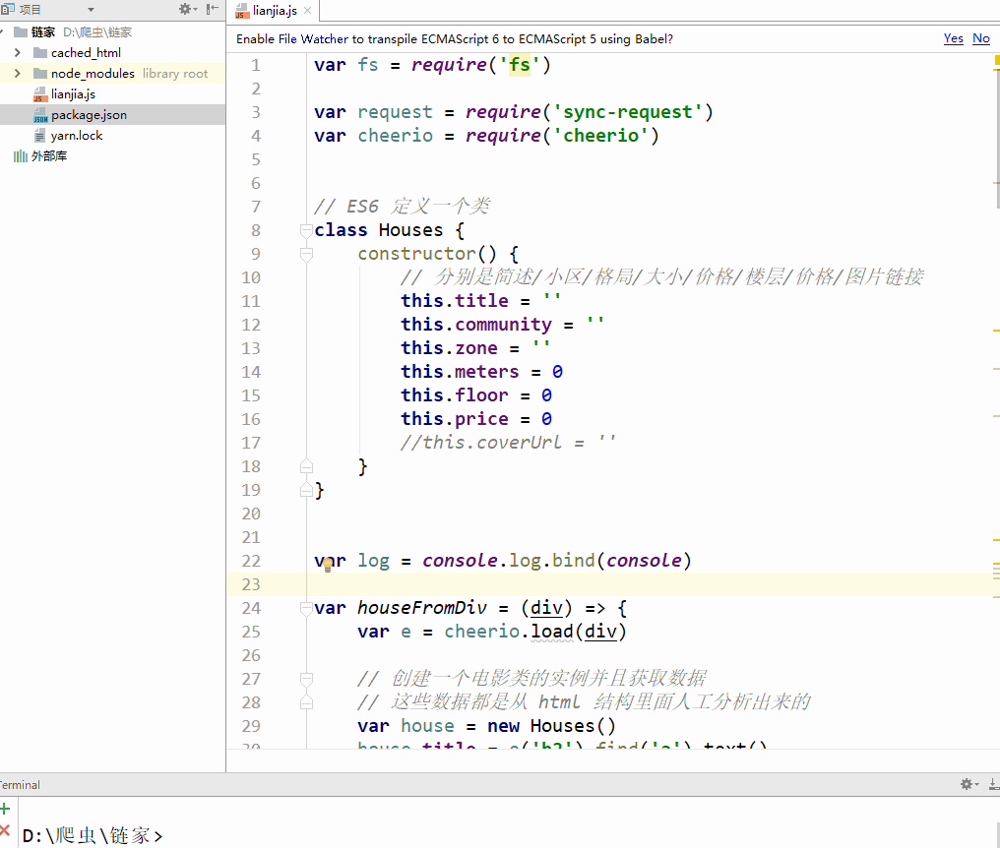

# practice

## todoList

----------------------------------------

以下项目利用cearte-react-app完成

项目运行

yarn install  (安装依赖包)

yarn start (运行本地开发环境)
## 轮播图

## 照片墙

----------------------------------------
以下项目为node项目

项目运行

yarn install  (安装依赖包)

node app.js (运行本地开发环境)

## 爬虫

## 使用echarts展示爬虫得到的数据

